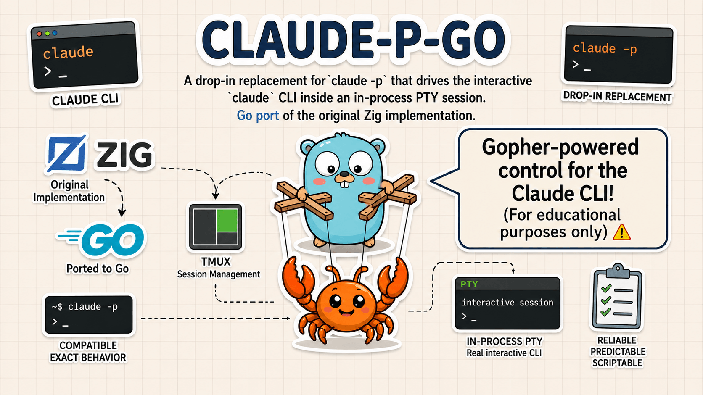

<p align="center">
  
</p>

<p align="center">
  <a href="https://pkg.go.dev/github.com/jmadore-payfacto/claude-p-go"></a>
  <a href="https://goreportcard.com/report/github.com/jmadore-payfacto/claude-p-go"></a>
  <a href="./go.mod"></a>
  <a href="./LICENSE"></a>
</p>

# claude-p-go

> **Use at your own risk.** This package and repository exist for
> **educational purposes** and demonstrate why client-side restrictions
> on how a product is used are fundamentally unenforceable.

A drop-in replacement for `claude -p` that drives the interactive
`claude` CLI inside an in-process PTY session. **Go port** of the
original Zig implementation.

## Use

Install the CLI:

```bash
go install github.com/jmadore-payfacto/claude-p-go/cmd/claude-p@latest
```

Then run it like `claude -p`:

```bash
claude-p "your prompt here"
```

Output on stdout matches `claude -p` byte-for-byte.

```bash
claude-p --output-format json "summarize this commit" < commit.diff
claude-p --output-format stream-json "audit ./" --verbose | jq .
claude-p --model opus "explain quicksort to a 10-year-old"
```

## How it works

1. Spawns `claude` interactively inside a PTY (via
   [`github.com/creack/pty`](https://github.com/creack/pty)) with a
   reader goroutine and a bounded rolling buffer.
2. A small ANSI scanner answers the DA1 / DA2 / DSR / XTVERSION /
   window-size queries Ink (the React-for-terminals runtime Claude
   Code uses) issues at startup. Without these, the TUI hangs.
3. Registers two hooks via `--settings '<inline-json>'` — never
   touches your `~/.claude/` config:
   - **`SessionStart`** — the wrapper types the prompt + Enter.
   - **`Stop`** — fires when the model finishes; payload carries
     `transcript_path`.
4. Reads the transcript JSONL, extracts the final assistant message
   plus usage, and prints in the requested format.

## Flags

```
--output-format <text|json|stream-json>   default: text
--model <name>
--max-turns <N>
--allowedTools <list>
--dangerously-skip-permissions
--resume <id> | --continue | --session-id <uuid>
--cwd <path>
--input-file <path>
--verbose
--timeout <seconds>                       default: 300
--debug
```

Unrecognized flags are forwarded verbatim to `claude`.

## Exit codes

| Code  | Meaning                                                               |
| ----- | --------------------------------------------------------------------- |
| `0`   | Success.                                                              |
| `1`   | Assistant returned an error (`is_error: true`) or transcript missing. |
| `2`   | Wrapper internal error (PTY failure, spawn failed, etc.).             |
| `124` | Timed out or `--max-turns` exceeded.                                  |
| `130` | Interrupted (SIGINT).                                                 |

## Caveats

- **macOS / Linux only.** No Windows (no `forkpty`).
- **Requires `claude` on `$PATH`.** The wrapper invokes the real CLI.
- **Not true streaming.** Tokens are not streamed live — `claude-p`
  waits for the model's turn to finish and then prints. For real-time
  streaming, use `claude -p --output-format stream-json` directly.
- **Adds ~50–200 ms** over `claude -p` due to PTY + Ink startup
  overhead.
- **Multiline prompts** must come via `--input-file` or stdin to keep
  shell escaping sane.
- **API instability.** `claude` is not designed to be driven this way.
  A future Claude Code release that changes the hook payload schema or
  adds a new terminal probe at startup can break us; the wrapper will
  surface the failure rather than hide it.

## From source

```bash
git clone https://github.com/jmadore-payfacto/claude-p-go
cd claude-p-go
go build ./cmd/claude-p
```

Requires Go **1.25+**.

## As a Go library

```bash
go get github.com/jmadore-payfacto/claude-p-go
```

```go
package main

import (
	"fmt"
	"os"

	claudep "github.com/jmadore-payfacto/claude-p-go"
)

func main() {
	result, err := claudep.Run(claudep.Options{
		Prompt:          "what is the capital of France?",
		OutputFormat:    claudep.FormatText,
		SkipPermissions: true,
	})
	if err != nil {
		fmt.Fprintln(os.Stderr, err)
		os.Exit(1)
	}
	fmt.Println(result.Summary().FinalText)
}
```

The `Options` struct mirrors the CLI flags 1:1. See [`claudep.go`](./claudep.go)
for the full API.

Runnable end-to-end examples live under [`examples/`](./examples/):

| Example | What it shows |
| ------- | ------------- |
| [`examples/text`](./examples/text/) | Programmatic access to `Summary` — final text, turns, cost. |
| [`examples/json`](./examples/json/) | `result.Write(os.Stdout, FormatJSON)` plus typed access to `Usage`. |
| [`examples/stream-json`](./examples/stream-json/) | Stream-JSONL output + walking the replay line-by-line in-process. |

```bash
go run ./examples/text        "what is the capital of France?"
go run ./examples/json        "summarize Go's net/http package in 2 sentences" | jq .usage
go run ./examples/stream-json "explain quicksort" | jq -c 'select(.type=="assistant")'
```

All three require `claude` on `$PATH` and a live Claude Code login.

## Relation to the original

This is a Go port of the original Zig
[`claude-p`](https://github.com/smithersai/claude-p). Behavior, CLI
surface, exit codes, and stdout format are intended to match
byte-for-byte. The implementation differs:

- **Zig `NativeSession`** → **`github.com/creack/pty`** for PTY I/O.
- **Threads + arenas** → goroutines + GC.
- **Inline JSON builder** → `encoding/json`.

## License

MIT.

The claude-p-go logo is adapted from the Go gopher designed by Renee French and licensed under the Creative Commons 3.0 Attributions license.
